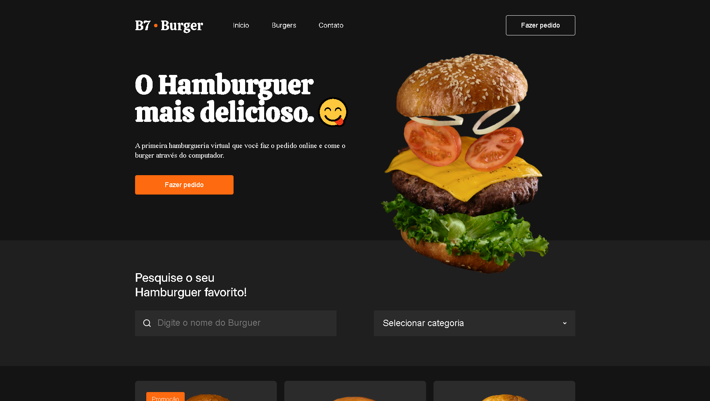

# 🍔 B7Burger Landing Page

Projeto de landing page inspirado em um site de restaurante, desenvolvido como parte dos exercícios do curso da **B7Web**, com aprimoramentos próprios para praticar CSS Grid, Flexbox e responsividade.

## 📸 Preview do Projeto

 

## 📚 Tecnologias Utilizadas

- HTML5
- CSS3
- Google Fonts

## 🎯 Objetivos do Projeto

- Praticar CSS Grid para organizar as áreas do layout em colunas e linhas
- Usar Flexbox para alinhar itens em seções como o cabeçalho
- Aplicar responsividade para diversos tamanhos de tela (desktop, tablet e mobile)
- Trabalhar com imagens de fundo e adaptação fluida
- Utilizar boas práticas de estruturação HTML e organização de CSS

## 🧪 Status

✔️ Projeto finalizado e funcional  
🛠️ Aberto para melhorias futuras, como animações, interatividade ou transições suaves

## 👨‍💻 Autor

Desenvolvido por Tiago Lima  
🔗 [Meu GitHub](https://github.com/ti-limaa)
